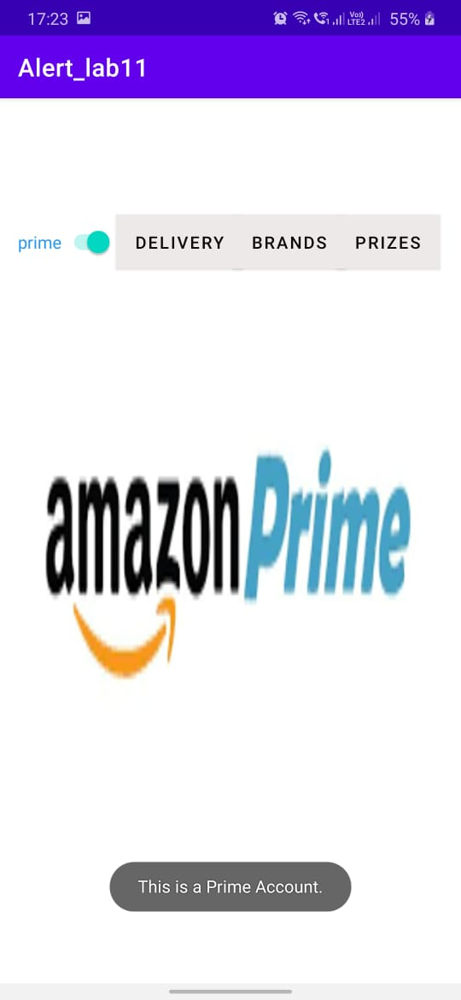
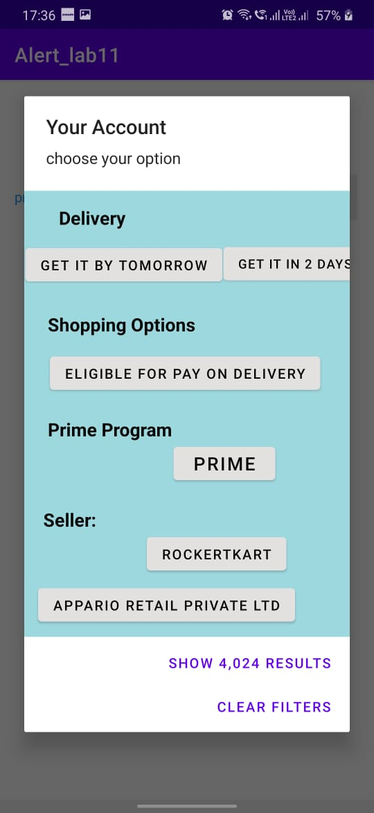
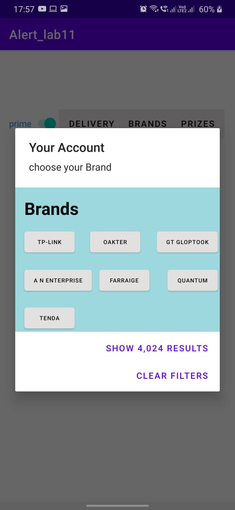
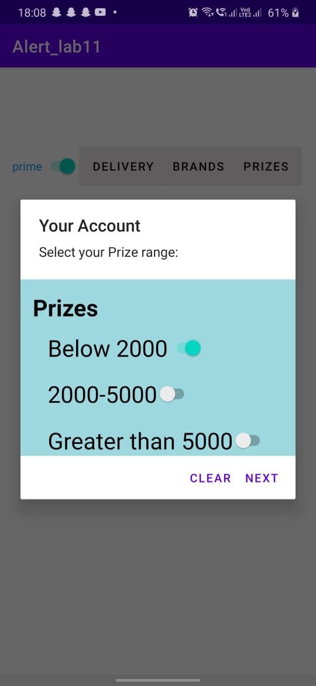

# AlertBox_Example
A project-based on Alert Box and Toast. Here an application for beginners to learn how to Create an Alert box and alignment boxes and displaying it. Have taken pics from google and Template I have used the prime account interface. This project is useful for beginners in android studios.
 # The Main page:

# Delivery:

# Payment:

# Brands:

